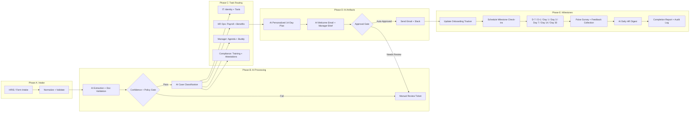
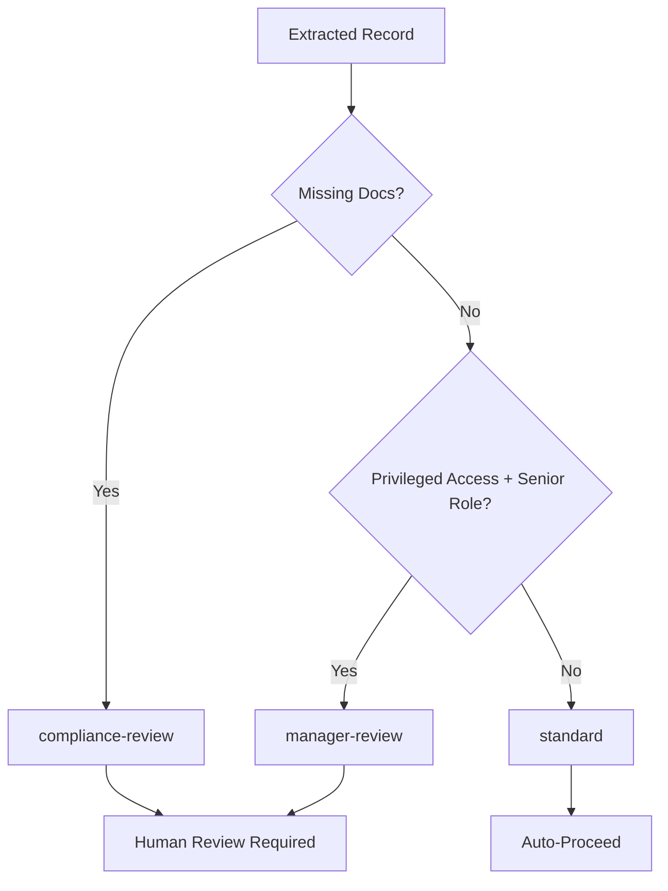

# Onboarding Architecture Diagram

## Full Pipeline

```mermaid
flowchart LR
    subgraph "Phase A: Intake"
        A[HRIS / Form Intake] --> B[Normalize + Validate]
    end

    subgraph "Phase B: AI Processing"
        B --> C[AI Extraction + Doc Validation]
        C --> D{Confidence + Policy Gate}
        D -->|Fail| E[Manual Review Ticket]
        D -->|Pass| F[AI Case Classification]
    end

    subgraph "Phase C: Task Routing"
        F --> G[IT: Identity + Tools]
        F --> H[HR Ops: Payroll + Benefits]
        F --> I[Manager: Agenda + Buddy]
        F --> J[Compliance: Training + Attestations]
    end

    subgraph "Phase D: AI Artifacts"
        H --> K[AI Personalized 14-Day Plan]
        K --> L[AI Welcome Email + Manager Brief]
        L --> M{Approval Gate}
        M -->|Auto-Approved| N[Send Email + Slack]
        M -->|Needs Review| E
    end

    subgraph "Phase E: Milestones"
        N --> O[Update Onboarding Tracker]
        O --> P[Schedule Milestone Check-ins]
        P --> Q[D-7 / D-1 / Day 1 / Day 3 / Day 7 / Day 14 / Day 30]
        Q --> R[Pulse Survey + Feedback Collection]
        R --> S[AI Daily HR Digest]
        S --> T[Completion Report + Audit Log]
    end
```

## Decision Logic Detail

```mermaid
flowchart TD
    X[Extracted Record] --> Y{Missing Docs?}
    Y -->|Yes| Z1[compliance-review]
    Y -->|No| Z2{Privileged Access + Senior Role?}
    Z2 -->|Yes| Z3[manager-review]
    Z2 -->|No| Z4[standard]
    Z1 --> Z5[Human Review Required]
    Z3 --> Z5
    Z4 --> Z6[Auto-Proceed]
```
