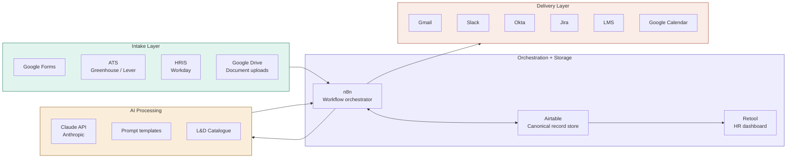

# Onboarding Automation — Workflow Overview

## Pipeline sequence

```mermaid
flowchart TD
    A([New hire record created\nHRIS / ATS / Google Forms]) --> B

    B[Stage 1 — Intake\nAI: Extraction\nClaude parses raw document\ninto structured JSON]
    B --> C{Fields complete?}
    C -- No --> HR1([HR Review\nMissing data / ambiguous role])
    HR1 -.->|resolved| C
    C -- Yes --> D

    D[Stage 2 — Validation\nAI: Classification\nDocument check + compliance\nvalidation by jurisdiction]
    D --> E{Validation status}
    E -- Failed / Blocked --> HR2([HR + Compliance Review\nMissing docs / expired / jurisdiction gap])
    HR2 -.->|resolved| E
    E -- Passed --> F

    F[Stage 3 — Profile Creation\nAccounts provisioned\nOkta · Slack · Jira · Google Workspace]
    F --> G{Elevated access?}
    G -- Yes --> HR3([Security Review\nElevated permission gate])
    HR3 -.->|approved| G
    G -- No / Approved --> H

    H[Stage 4 — Task Routing\nAI: Decision Support\nRole-matched task queue\nassigned to IT · HR · Facilities · Manager]
    H --> I{Senior / multi-jurisdiction?}
    I -- Yes --> HR4([Manager + HR Approval\nTask set review])
    HR4 -.->|approved| I
    I -- No / Approved --> J

    J[Stage 5 — Onboarding Plan\nAI: Generation + Summarisation\n30/60/90-day plan · Manager summary\nTraining recommendations]
    J --> K{Manager approval}
    K -- Pending --> HR5([Manager Review\nPlan approved in Retool])
    HR5 -.->|approved| K
    K -- Approved --> L

    L[Stage 6 — Communication\nAI: Generation\nWelcome email · Slack message\nCalendar invites dispatched]
    L --> M{Executive hire?}
    M -- Yes --> HR6([HR Comms Review\nBefore send])
    HR6 -.->|approved| M
    M -- No / Approved --> N

    N[Stage 7 — Tracking\nAI: Summarisation + Decision Support\n90-day progress monitoring\nWeekly health dashboard]
    N --> O{At risk?}
    O -- Yes --> HR7([HR Escalation\nManager nudge + HR queue task])
    HR7 -.->|resolved| O
    O -- No --> P([Onboarding complete])

    style A fill:#E1F5EE,stroke:#0F6E56,color:#085041
    style P fill:#EAF3DE,stroke:#3B6D11,color:#27500A
    style HR1 fill:#FAECE7,stroke:#993C1D,color:#712B13
    style HR2 fill:#FAECE7,stroke:#993C1D,color:#712B13
    style HR3 fill:#FAECE7,stroke:#993C1D,color:#712B13
    style HR4 fill:#FAECE7,stroke:#993C1D,color:#712B13
    style HR5 fill:#FAECE7,stroke:#993C1D,color:#712B13
    style HR6 fill:#FAECE7,stroke:#993C1D,color:#712B13
    style HR7 fill:#FAECE7,stroke:#993C1D,color:#712B13
    style B fill:#EEEDFE,stroke:#534AB7,color:#3C3489
    style D fill:#EEEDFE,stroke:#534AB7,color:#3C3489
    style F fill:#EEEDFE,stroke:#534AB7,color:#3C3489
    style H fill:#EEEDFE,stroke:#534AB7,color:#3C3489
    style J fill:#EEEDFE,stroke:#534AB7,color:#3C3489
    style L fill:#EEEDFE,stroke:#534AB7,color:#3C3489
    style N fill:#EEEDFE,stroke:#534AB7,color:#3C3489
```



---

## System integration map



---

## AI task map

| Stage | AI Task Type | Prompt | Output Format |
|---|---|---|---|
| 1 — Intake | Extraction | Prompt 1 | JSON — OnboardingRecord |
| 2 — Validation | Classification | Prompt 2 | JSON — validation result |
| 5 — Plan (parallel) | Generation | Prompt 3 | Markdown — 30/60/90-day plan |
| 5 — Plan (parallel) | Summarisation | Prompt 5 | Markdown — manager briefing |
| 5 — Plan (parallel) | Decision Support | Prompt 6 | Ranked list — training modules |
| 6 — Communication | Generation | Prompt 4 | Plain text — subject + email body |
| 7 — Tracking | Summarisation + Decision Support | Inline | Health score + at-risk flag |

---

## Human-in-the-loop gates

| Gate | Stage | Condition | Pipeline effect |
|---|---|---|---|
| Missing hire data | 1 — Intake | Required fields absent | Blocked — awaits HR correction |
| Document compliance | 2 — Validation | Missing / expired / jurisdiction gap | Blocked — awaits HR/Compliance |
| Elevated access | 3 — Profile Creation | Security-sensitive role | Paused — awaits security approval |
| Non-standard task plan | 4 — Task Routing | Senior / executive / multi-jurisdiction | Paused — awaits manager approval |
| Plan approval | 5 — Onboarding Plan | All hires | Paused — mandatory manager sign-off |
| Executive comms | 6 — Communication | VP+ hires | Paused — HR review before send |
| At-risk escalation | 7 — Tracking | Low completion / negative sentiment | Alert — manager + HR notified |

---

## Error handling levels

```
Level 1 — AI Response errors     → retry ×3 with backoff → HR queue
Level 2 — Validation blocks      → pipeline halt → Slack alert + HR queue
Level 3 — Provisioning failures  → retry ×3 → IT queue → partial continue
Level 4 — Delivery failures      → retry ×3 (10 min backoff) → HR manual send
```

Global rule: any error unresolved after 3 retries or 24 hours → Slack escalation to HR manager + IT lead.
